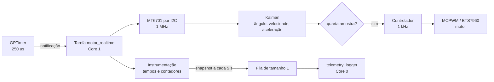

# Guia do código e da arquitetura de tempo real

Este documento explica como a aplicação funciona, do boot até o acionamento do
motor. O objetivo principal é deixar explícita a diferença entre quatro partes
que cooperam, mas possuem responsabilidades e módulos diferentes:

| Parte | O que faz | Altera o motor? | Mede tempo? | Imprime logs? |
|---|---|---:|---:|---:|
| Aquisição e estimação | Lê o MT6701 e atualiza o Kalman | Não | Não | Não |
| Controle | Calcula e aplica a saída na ponte H | Sim | Não | Não |
| Instrumentação | Mede duração, jitter, erros e deadlines | Não | Sim | Não |
| Telemetria | Copia resultados e os apresenta ao usuário | Não | Não | Sim, somente no Core 0 |

Instrumentação e telemetria não são sinônimos. A **instrumentação** produz as
medições de desempenho dentro da tarefa de tempo real. A **telemetria** apenas
transporta uma fotografia dessas medições para outra tarefa e escreve o
relatório no console.

## 1. Visão geral

O firmware trabalha com duas frequências:

- **4 kHz / 250 µs:** aquisição do ângulo e atualização do estimador de Kalman;
- **1 kHz / 1 ms:** cálculo e aplicação da ação de controle.

Um GPTimer dispara a cada 250 µs. Sua interrupção não lê o sensor, não executa o
Kalman e não controla o motor. Ela apenas notifica a tarefa de tempo real.



O Core 1 é reservado para aquisição, estimação e controle. O Core 0 executa a
inicialização, serviços do sistema e os logs.

## 2. Arquivos e responsabilidades

### `main/main.c` — inicialização da aplicação

É deliberadamente pequeno. Ele:

1. monta `motor` com os pinos e a frequência definidos no Kconfig;
2. chama `engine_driver_init()` para configurar MCPWM e a ponte H;
3. chama `realtime_loop_start()`;
4. coloca a saída do motor em zero se a criação do loop falhar.

Não existe controle periódico em `app_main()`. Depois que as tarefas são
criadas, `app_main()` pode retornar normalmente.

### `main/realtime_loop.c` — aquisição, estimação e controle

Este arquivo contém três blocos do caminho crítico:

1. **Agendamento:** GPTimer, ISR e notificação da tarefa;
2. **Aquisição/estimação:** MT6701 e Kalman a 4 kHz;
3. **Controle:** chamada ao controlador e escrita do PWM a 1 kHz;
Ele também mantém a instrumentação temporal e chama a API de telemetria somente
para publicar um snapshot a cada cinco segundos. A fila, a tarefa de logger, a
política de descarte e a formatação dos logs não ficam mais neste arquivo.

### `main/realtime_telemetry.c` — transporte e apresentação

Implementa tudo que não precisa pertencer ao caminho de controle:

- cria e destrói a fila e a tarefa de logger;
- recebe cópias de `realtime_telemetry_snapshot_t`;
- substitui snapshots antigos sem bloquear o Core 1;
- calcula as taxas efetivas da janela;
- seleciona as janelas silenciosas;
- formata e imprime todos os logs no Core 0.

`realtime_telemetry.h` define o contrato entre os módulos. A telemetria recebe
valores prontos e nunca conhece os objetos vivos do sensor, Kalman ou motor.

### `main/motor_controller.c` — lei de controle

Implementa o PID de velocidade executado a 1 kHz:

```c
float motor_controller_update(motor_controller_t *controller,
                              float measured_speed_rpm, float dt)
```

A referência alterna automaticamente entre 600 e 900 RPM a cada 10 segundos.
A velocidade estimada pelo Kalman fecha a malha. A função calcula os termos P,
I e D usando o `dt` real, limita a saída entre 0% e 100% e emprega anti-windup
condicional.

Os ganhos são variáveis estáticas no início de `motor_controller.c`, para
facilitar a sintonia manual:

```c
static float pid_kp = 0.05f;
static float pid_ki = 0.02f;
static float pid_kd = 0.00f;
```

A derivada é calculada sobre a velocidade medida, com filtro passa-baixas de
20 ms. Isso evita o impulso derivativo causado diretamente pelo degrau da
referência. O ganho derivativo começa em zero e pode ser introduzido depois da
sintonia de P e I.

### `main/engine_angle_kalman.c` — estimação circular

Atualiza o estado tridimensional:

- `x[0]`: ângulo em graus;
- `x[1]`: velocidade angular em graus por segundo;
- `x[2]`: aceleração angular em graus por segundo ao quadrado.

A função executa predição e correção do Kalman. A inovação angular é
normalizada em `[-180°, 180°]`, evitando um salto falso de aproximadamente
360° quando o encoder atravessa a fronteira entre 359° e 0°.

### `components/esp-mt6701` — driver do sensor

`mt6701_update()` realiza uma leitura I2C em burst dos registradores `0x03` e
`0x04`, reconstrói os 14 bits e atualiza o estado interno do driver:

- ângulo calibrado mais recente;
- direção e offset aplicados em software;
- contador de voltas;
- estimativa de velocidade própria do driver.

Nesta aplicação, a velocidade usada no controle e na telemetria é a estimada
pelo Kalman, não `velocity_rad_s` do driver. O contador de voltas do driver é
usado somente na telemetria.

`mt6701_get_last_angle_degrees()` converte a amostra já armazenada por
`mt6701_update()`. Ela não inicia uma segunda transação I2C.

### `components/esp-engine-driver` — acionamento da ponte H

Configura o MCPWM e converte a saída percentual em sinais RPWM/LPWM para o
BTS7960. O PWM trabalha a 20 kHz por padrão. O loop de controle escreve um novo
duty cycle a 1 kHz; isso não altera a frequência física do PWM.

## 3. Inicialização completa

### Etapa 1 — `app_main()` no Core 0

O motor é configurado primeiro. Se `engine_driver_init()` falhar, nenhuma tarefa
de tempo real é criada.

### Etapa 2 — `realtime_loop_start()`

A função:

1. chama `realtime_telemetry_start()`, que cria a fila de um snapshot e
   `telemetry_logger` no Core 0;
2. cria `motor_realtime` no Core 1, com prioridade máxima da aplicação.

A fila usa `xQueueOverwrite()`. Se o logger ainda não consumiu o snapshot
anterior, o dado antigo é substituído. Isso é intencional: telemetria atrasada
não pode bloquear o controle.

### Etapa 3 — preparação dentro de `motor_realtime`

O próprio Core 1 cria os recursos usados no caminho crítico:

1. estado do controlador PID e perfil de referência;
2. barramento mestre I2C;
3. dispositivo MT6701 no endereço `0x06` e clock configurado;
4. estado inicial do sensor e primeira amostra;
5. filtro de Kalman inicializado com o ângulo atual;
6. GPTimer periódico de 250 µs.

Criar I2C e GPTimer dentro da tarefa fixada ajuda a manter as interrupções dos
periféricos associadas ao mesmo núcleo do loop.

O barramento usa `I2C_NUM_0`, fonte de clock padrão do ESP-IDF, filtro de glitch
com contagem 7 e habilita os pull-ups internos. SDA, SCL e frequência vêm do
Kconfig. Com o padrão de 1 MHz, pull-ups externos adequados continuam sendo
necessários para garantir bordas rápidas no circuito real. O MT6701 é colocado
na direção lógica `MT6701_DIR_CW`; offset zero e inversão permanecem funções do
driver e podem ser configurados antes de iniciar o timer.

O Kalman começa no primeiro ângulo válido do sensor, evitando uma grande
inovação artificial no primeiro ciclo. A configuração atual é:

| Parâmetro | Valor de referência | Escala para 4 kHz | Valor aplicado |
|---|---:|---:|---:|
| `Q_theta` | 0,001 | 0,25 | 0,00025 |
| `Q_omega` | 10 | 0,25 | 2,5 |
| `Q_alpha` | 100 | 0,25 | 25 |
| `R` | 0,0004 | não se aplica | 0,0004 |

A escala é `KALMAN_REFERENCE_RATE_HZ / REALTIME_SENSOR_RATE_HZ`, isto é,
`1000 / 4000`. Esses números são parâmetros de sintonia do modelo, não
características obrigatórias do MT6701.

Se sensor ou timer falharem durante a inicialização, a saída do motor é levada
a zero e a tarefa é encerrada.

## 4. Agendamento a 4 kHz

### `sampling_timer_callback()` — interrupção mínima

A ISR faz somente três coisas:

1. registra o instante da interrupção em `last_timer_isr_time_us`;
2. incrementa a notificação direta da tarefa com
   `vTaskNotifyGiveFromISR()`;
3. solicita uma troca de contexto caso a tarefa despertada tenha prioridade.

I2C, ponto flutuante, filtro e MCPWM ficam fora da ISR.

O GPTimer possui resolução de 1 MHz, portanto cada tick vale 1 µs. O alarme é
configurado com 250 ticks, recarga automática e contagem crescente, produzindo
exatamente os 4 kHz nominais.

### Espera na tarefa

`ulTaskNotifyTake(pdTRUE, portMAX_DELAY)` bloqueia `motor_realtime` sem polling.
Quando a tarefa desperta, o valor retornado informa quantas notificações estavam
acumuladas.

- `1`: um ciclo normal;
- maior que `1`: o loop não acompanhou algum período; o excedente entra em
  `missed_timer_events`.

O contador `missed` representa deadlines de amostragem que não puderam receber
uma execução individual. As notificações foram acumuladas pelo FreeRTOS, mas o
firmware processa somente uma nova leitura ao despertar; ele não tenta executar
várias leituras atrasadas em sequência.

## 5. Caminho de aquisição e estimação — 4 kHz

Em cada despertar, a ordem é:

1. medir a latência entre a ISR e o início efetivo da tarefa;
2. chamar `mt6701_update()`;
3. medir a duração da chamada I2C completa;
4. se a leitura funcionou, calcular `sample_dt_us` usando o fim das leituras
   atual e anterior;
5. obter o ângulo calibrado armazenado no driver;
6. converter `dt` de microssegundos para segundos;
7. atualizar o Kalman;
8. incrementar os contadores do estimador.

O instante usado no `dt` é o final da transação I2C. Isso aproxima o timestamp
do momento em que a amostra ficou disponível, em vez de assumir rigidamente
250 µs.

Se o I2C falhar:

- o erro é contado em `sensor_errors`;
- o Kalman não recebe uma medida inválida naquele ciclo;
- o loop continua e tenta novamente no próximo período.

O filtro só é atualizado se `0 < dt < 0,1 s`. Esse limite rejeita intervalos
claramente inválidos após uma pausa excepcional.

## 6. Caminho de controle — 1 kHz

`CONTROL_DIVIDER` é calculado como `4000 / 1000 = 4`. A variável
`control_divider` é incrementada em cada despertar de 4 kHz. A cada quarta
amostra:

1. mede-se o `dt` real desde a chamada anterior do controlador;
2. converte-se `x[1]` do Kalman de graus/s para RPM dividindo por 6;
3. chama-se `motor_controller_update()`;
4. aplica-se o resultado com `engine_driver_set_speed()`;
5. incrementam-se os contadores de controle.

O caminho fechado é:

```text
referência ─► erro ─► PID ─► ponte H ─► motor ─► MT6701/Kalman ─┐
               ▲                                               │
               └──────────── velocidade estimada ◄─────────────┘
```

A referência começa em 600 RPM e muda para 900 RPM após 10 segundos. Depois
continua alternando a cada 10 segundos. O integrador não é zerado no degrau,
preservando uma transição sem descontinuidade artificial na ação integral.

Como os relatórios silenciosos aparecem aproximadamente em 5, 15, 25... s, o
primeiro mostra a resposta à referência baixa e os seguintes mostram o estado
cerca de cinco segundos após cada degrau. A telemetria pontual ajuda a observar
erro residual e termos do PID, mas não substitui uma captura rápida quando for
necessário medir overshoot e tempo de acomodação com precisão.

## 7. Instrumentação temporal — mede, mas não imprime

A instrumentação está dentro de `motor_realtime` porque somente ali é possível
medir o caminho crítico. Ela usa `esp_timer_get_time()` e acumula resultados em
`timing_window_t` durante uma janela de aproximadamente 5 segundos.

### Medidas de tempo

| Campo | Início | Fim | O que revela |
|---|---|---|---|
| `wake` | timestamp gravado pela ISR | tarefa acordada | latência ISR → tarefa |
| `i2c` | antes de `mt6701_update()` | retorno da função | transação e overhead do driver |
| `kalman` | antes de ler o cache/atualizar filtro | fim da atualização | custo da estimação |
| `control` | início do bloco de 1 kHz | após escrever o motor | custo do controlador + MCPWM |
| `processing` | antes do I2C | fim do ciclo | I2C + Kalman + controle quando aplicável |
| `cycle` | interrupção | fim do ciclo | `wake + processing` |

Todos os campos da linha `window max` são **máximos observados**, não médias.

### Intervalos e contadores

| Campo | Significado |
|---|---|
| `sample dt` | menor e maior intervalo real entre amostras I2C válidas |
| `control dt` | menor e maior intervalo entre execuções do controlador |
| `estimator_updates` | atualizações válidas do Kalman na janela |
| `control_updates` | execuções do controlador na janela |
| `missed_timer_events` | períodos excedentes acumulados ao despertar |
| `sensor_errors` | falhas retornadas pelo caminho I2C/MT6701 |
| `deadline_overruns` | ciclos cujo `cycle` excedeu 250 µs |

`lifetime_max_processing_time_us` nunca é reiniciado. Por isso um pico de boot
pode continuar aparecendo durante toda a execução. Os demais máximos são
reiniciados a cada janela e descrevem melhor o comportamento recente.

## 8. Telemetria — transporta e imprime

A telemetria não participa do controle. A cada 5 segundos,
`publish_telemetry_snapshot()` em `realtime_loop.c`:

1. consulta o contador total de voltas do MT6701;
2. copia estado físico, contadores e instrumentação para
   `realtime_telemetry_snapshot_t`;
3. chama `realtime_telemetry_publish()`;
4. reinicia a janela de instrumentação;
5. mede quanto a própria publicação demorou.

O módulo `realtime_telemetry.c` faz o `xQueueOverwrite()` e seu logger no Core 0
formata e imprime os dados. Não existe `ESP_LOGI()` dentro do ciclo periódico do
Core 1 depois que o timer começa.

### Por que um relatório aparece a cada 10 segundos?

Os snapshots continuam sendo produzidos a cada 5 segundos. Porém, imprimir no
console pode interferir em recursos compartilhados do SoC. O logger alterna:

1. imprime uma janela que permaneceu sem logs;
2. descarta a janela seguinte, que pode ter sido perturbada pela impressão;
3. imprime a próxima janela silenciosa.

Assim, a instrumentação mantém janelas de 5 segundos, mas o usuário recebe um
relatório confiável a cada 10 segundos.

## 9. Como interpretar cada linha do log

### Estado físico e saída

```text
silent window: angle=238.096/238.071 deg speed=753.077 RPM
accel=-20.861 RPM/s turns=189
control: reference=900.0 RPM error=146.9 RPM
pid=7.35/42.10/0.00% output=49.5%
```

- primeiro `angle`: última medida calibrada do MT6701;
- segundo `angle`: ângulo estimado pelo Kalman;
- `speed`: `x[1]` do Kalman convertido para RPM;
- `accel`: `x[2]` do Kalman convertido para RPM/s;
- `turns`: voltas acumuladas pelo driver MT6701.

Na linha `control`:

- `reference`: referência ativa do perfil de degrau;
- `error`: referência menos velocidade estimada;
- `pid`: contribuições proporcional, integral e derivativa, nessa ordem;
- `output`: soma PID saturada e aplicada à ponte H.

### Taxas e falhas da janela

```text
window: rate=4000.0/1000.0 Hz missed=0 errors=0 overruns=0
```

- primeiro `rate`: atualizações válidas do estimador por segundo;
- segundo `rate`: ações de controle por segundo;
- `missed`: períodos de timer não processados individualmente;
- `errors`: erros do sensor/I2C;
- `overruns`: ciclos acima do deadline de 250 µs.

### Máximos temporais

```text
window max: wake=7 i2c=135 kalman=3 control=7 processing=151
cycle=158 us lifetime_processing=449 us previous_telemetry=21 us
```

- `wake`, `i2c`, `kalman`, `control`, `processing` e `cycle`: definições da
  tabela de instrumentação;
- `lifetime_processing`: maior processamento desde o início, incluindo picos
  antigos;
- `previous_telemetry`: custo, no Core 1, de montar e enfileirar o snapshot
  anterior; não inclui o tempo gasto imprimindo no Core 0.

### Jitter e totais

```text
window dt: sample=236..266 us control=1000..1000 us
totals: est=180001 ctl=45000 missed=1 errors=0
```

- os intervalos mostram mínimo e máximo da janela;
- `totals` são acumulados desde o início e podem incluir eventos ocorridos em
  janelas que o logger descartou.

Por isso é possível ler `missed=0` na janela atual e `totals: missed=1`: o
evento acumulado aconteceu anteriormente, possivelmente numa janela não
impressa.

## 10. Estruturas internas

### `realtime_loop_context_t`

Contém os recursos funcionais de longa duração: motor, barramento I2C,
dispositivo I2C, estado do MT6701 e estado do Kalman. Somente a tarefa do Core 1
modifica esse conjunto depois da inicialização.

### `timing_window_t`

É exclusivamente instrumentação. Guarda contadores e extremos temporais da
janela atual. Não contém a lei de controle e não é consumida diretamente pelo
logger.

### `realtime_telemetry_snapshot_t`

É definido em `realtime_telemetry.h` e funciona como objeto de transferência
entre os núcleos. Contém uma cópia dos resultados físicos e da instrumentação.
O logger nunca recebe ponteiros para o estado vivo do Kalman ou do sensor.

### `motor_controller_t`

É o estado privado da lei de controle. Guarda referência atual, erro,
contribuição integral, derivada filtrada da velocidade, amostra anterior,
temporização do perfil, termos P/D, saída e flags de inicialização.

## 11. Constantes importantes

| Constante | Valor atual | Função |
|---|---:|---|
| `REALTIME_SENSOR_RATE_HZ` | 4000 Hz | frequência de aquisição e Kalman |
| `REALTIME_CONTROL_RATE_HZ` | 1000 Hz | frequência do controlador |
| `SENSOR_PERIOD_US` | 250 µs | período e deadline do ciclo rápido |
| `TELEMETRY_PERIOD_US` | 5 s | duração de cada janela |
| `REALTIME_TASK_PRIORITY` | máxima - 1 | prioridade do caminho crítico |
| `TELEMETRY_TASK_PRIORITY` | 1 | prioridade da apresentação de dados |

O clock I2C não é uma constante fixa no arquivo. Ele vem de
`CONFIG_APP_I2C_CLOCK_HZ`, atualmente 1 MHz.

## 12. Concorrência e propriedade dos recursos

| Recurso | Proprietário após o boot | Observação |
|---|---|---|
| MT6701 e I2C | `motor_realtime`, Core 1 | acesso exclusivo |
| Kalman | `motor_realtime`, Core 1 | logger recebe somente cópia |
| MCPWM/motor | `motor_realtime`, Core 1 | inicializado antes no Core 0 |
| `timing_window_t` | `motor_realtime`, Core 1 | nunca compartilhado |
| fila de telemetria | produtor Core 1 / consumidor Core 0 | capacidade 1, overwrite |
| console | `telemetry_logger`, Core 0 | fora do caminho crítico |

Os mutexes dos drivers estão desabilitados em `sdkconfig.defaults` porque há um
único proprietário para sensor e motor durante a operação periódica. Essa
decisão deixará de ser válida se outra tarefa começar a acessar diretamente
esses recursos.

## 13. Configuração relevante

### Aplicação

- `CONFIG_APP_I2C_SDA_PIN`: GPIO SDA, padrão 8;
- `CONFIG_APP_I2C_SCL_PIN`: GPIO SCL, padrão 9;
- `CONFIG_APP_I2C_CLOCK_HZ`: clock do sensor, padrão 1 MHz.

### Motor

- `CONFIG_ENGINE_PWM_FREQ_HZ`: frequência MCPWM, padrão 20 kHz;
- `CONFIG_ENGINE_PIN_RPWM`: PWM de avanço, padrão GPIO 1;
- `CONFIG_ENGINE_PIN_LPWM`: PWM de retorno, padrão GPIO 2;
- `CONFIG_ENGINE_PIN_ENABLE`: enable comum, padrão GPIO 3.

### Determinismo

`sdkconfig.defaults` fixa CPU em 240 MHz, otimização de desempenho, afinidade de
serviços no Core 0 e suporte do GPTimer em memória interna. O tick do FreeRTOS
continua em 1 kHz; quem produz os 4 kHz é o GPTimer.

## 14. Onde modificar cada comportamento

| Objetivo | Local principal |
|---|---|
| Ajustar `Kp`, `Ki` e `Kd` | variáveis estáticas no início de `main/motor_controller.c` |
| Alterar níveis/período do degrau | variáveis `reference_*` em `main/motor_controller.c` |
| Alterar frequência de aquisição/controle | `main/realtime_loop.h` |
| Ajustar covariâncias do Kalman | `initialize_sensor_and_filter()` |
| Alterar período de telemetria | `TELEMETRY_PERIOD_US` |
| Mudar campos dos logs | `realtime_telemetry.h` e `realtime_telemetry.c` |
| Adicionar uma medida temporal | `timing_window_t` e bloco de instrumentação |
| Alterar pinos/clock | `idf.py menuconfig` |

Ao implementar o PID, preserve a separação: o controlador deve calcular apenas
a ação de controle; a instrumentação mede quanto ele demorou; a telemetria copia
e apresenta os resultados.
