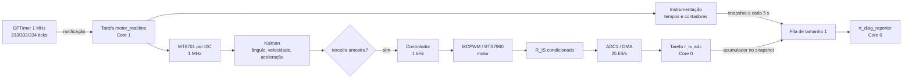

# Guia do código e da arquitetura de tempo real

Este documento explica como a aplicação funciona, do boot até o acionamento do
motor. O objetivo principal é deixar explícita a diferença entre quatro partes
que cooperam, mas possuem responsabilidades e módulos diferentes:

| Parte | O que faz | Altera o motor? | Mede tempo? | Imprime logs? |
|---|---|---:|---:|---:|
| Aquisição e estimação | Lê o MT6701 e atualiza o Kalman | Não | Não | Não |
| Controle | Calcula e aplica a saída na ponte H | Sim | Não | Não |
| Corrente | Adquire e agrega `R_IS` por ADC/DMA | Não | Não | Não |
| Instrumentação | Mede duração, jitter, erros e deadlines | Não | Sim | Não |
| Telemetria | Copia resultados e os apresenta ao usuário | Não | Não | Sim, somente no Core 0 |

Instrumentação e telemetria não são sinônimos. A **instrumentação** produz as
medições de desempenho dentro da tarefa de tempo real. A **telemetria** apenas
transporta uma fotografia dessas medições para outra tarefa e escreve o
relatório no console.

## 1. Visão geral

O firmware trabalha com duas frequências:

- **3 kHz / 333,333 µs:** aquisição do ângulo e atualização do estimador de Kalman;
- **1 kHz / 1 ms:** cálculo e aplicação da ação de controle.

Um GPTimer dispara a cada 333,333 µs. Sua interrupção não lê o sensor, não executa o
Kalman e não controla o motor. Ela apenas notifica a tarefa de tempo real.



O Core 1 é reservado para aquisição, estimação e controle. O Core 0 executa a
inicialização, serviços do sistema e os logs.

## 2. Arquivos e responsabilidades

### `main/main.c` — inicialização da aplicação

É deliberadamente pequeno. Ele:

1. monta `motor` com os pinos e a frequência definidos no Kconfig;
2. chama `engine_driver_init()` para configurar MCPWM e a ponte H;
3. chama `realtime_loop_start()`;
4. coloca a saída do motor em zero se a criação do loop falhar.

Não existe controle periódico em `app_main()`. Depois que as tarefas são
criadas, `app_main()` pode retornar normalmente.

### `main/realtime_loop.c` — aquisição, estimação e controle

Este arquivo contém três blocos do caminho crítico:

1. **Agendamento:** GPTimer, ISR e notificação da tarefa;
2. **Aquisição/estimação:** MT6701 e Kalman a 3 kHz;
3. **Controle:** chamada ao controlador e escrita do PWM a 1 kHz;
Ele alimenta o componente `esp_rt_diagnostics` e chama a API de telemetria
somente para publicar um snapshot quando a janela termina. A fila, a tarefa de
logger, a classificação das janelas e a formatação dos logs não ficam neste
arquivo.

### `components/esp_rt_diagnostics` — instrumentação reutilizável

Mantém `esp_rt_diag_t`, um acumulador estático com proprietário único. Sua API
inline registra ciclos, eventos perdidos, deadlines, eventos definidos pela
aplicação, duração média/máxima de etapas, violações de orçamento e intervalos
mínimo/máximo. O componente não
conhece MT6701, I2C, Kalman, PID ou motor e não cria fila, tarefa ou logger.

`CONFIG_ESP_RT_DIAGNOSTICS_ENABLE=n` transforma as chamadas do caminho crítico
em no-ops. O componente produz snapshots de diagnóstico por janela; ele não é
um gravador de séries temporais.

### `components/esp_timeseries_recorder` — séries temporais `int16_t`

Reserva em `.bss` uma região contínua de DRAM interna dimensionada por Kconfig.
A aplicação informa em `esp_timeseries_init()` a taxa do produtor, o número de
canais e, para cada canal, nome, unidade, escala e offset. A capacidade é
`buffer_bytes / (2 * channel_count)`; bytes finais que não formem um registro
completo não são utilizados.

Cada chamada `esp_timeseries_arm(rate_hz)` escolhe a taxa daquela captura. Ela
deve ser um divisor inteiro da taxa do produtor, garantindo espaçamento uniforme
e custo determinístico. No caminho de 1 kHz, `esp_timeseries_record_f32()` só
quantiza e escreve nos ciclos selecionados. Não aloca memória, imprime, calcula
CRC nem executa transporte.

Os estados são `EMPTY -> ARMED -> CAPTURING -> FULL -> EMPTY`. Somente `CLEAR`
libera uma captura cheia. Isso permite que o transporte USB repita um
`DUMP` quando o CRC calculado pelo Octave não conferir.

### `components/esp_timeseries_usb_transport` — protocolo USB nativo

Uma tarefa de baixa prioridade no Core 0 atende comandos ASCII na porta USB
Serial/JTAG nativa do ESP32-S3. `ARM <rate_hz>` arma uma captura imediatamente;
`STATUS` consulta o estado; `DUMP` envia um cabeçalho `TSRECORDER/1` terminado
por `END-HEADER`, seguido de `payload_bytes` bytes binários; e `CLEAR` só libera
uma captura cheia. O cabeçalho descreve dimensões, taxa, canais, unidades,
escala, offset, valor inválido e CRC-32/IEEE. O payload permanece intercalado
por amostra, em `int16_t` little-endian, sem cópia intermediária.

Comandos que não pertencem ao protocolo básico podem ser encaminhados a um
callback registrado pela aplicação. O transporte fornece temporariamente ao
callback operações para entrada/saída binária, respostas formatadas, erros e
status, mas não conhece o subsistema atendido pela extensão. Nesta aplicação,
`main/angle_lut_usb_commands.c` implementa a família `CAL ...`; assim, a
dependência de `esp_angle_lut` permanece em `main` e não no componente USB.

O transporte ocupa exclusivamente a porta USB nativa. Console e telemetria
continuam na UART0, acessível pela porta USB de gravação da placa, portanto não
há texto de log misturado ao payload. Uma falha ou desconexão durante `DUMP` não
executa `CLEAR`; a captura continua `FULL` e pode ser solicitada novamente.

### `components/esp-engine-driver` — atuação e aquisição de `R_IS`

Configura ADC1 em modo contínuo, DMA e um frame por milissegundo. A callback de
interrupção apenas notifica `r_is_adc`, uma tarefa de prioridade baixa no Core
0. Essa tarefa drena os frames, calcula média e mediana das 25 amostras de cada
milissegundo e acumula média, mínimo, máximo e erros para o snapshot longo.
Nenhuma conversão ADC bloqueante é executada em `motor_realtime`.

Ao publicar telemetria, o Core 1 entra numa seção crítica curta somente para
copiar e reiniciar o acumulador. A calibração ADC e os cálculos em volts/ampères
ocorrem depois, no logger do Core 0.

### `esp_rt_diagnostics_reporter` e `main/realtime_telemetry.c`

O componente reutilizável implementa o transporte e a apresentação genérica:

- cria e destrói a fila overwrite e a tarefa de reporter;
- recebe cópias de `esp_rt_diag_snapshot_t` e de um payload opaco;
- substitui snapshots antigos sem bloquear o Core 1;
- calcula as taxas efetivas da janela;
- classifica as janelas silenciosas e afetadas pelo próprio relatório;
- formata os diagnósticos genéricos no Core 0.

`realtime_telemetry.h` define somente o payload da aplicação. Seu callback
formata motor, corrente e gravador; ele recebe valores copiados e nunca conhece
os objetos vivos do sensor, Kalman ou motor. A escolha
`CONFIG_APP_RT_DIAGNOSTICS_APPLICATION_REPORT_*` seleciona apresentação ausente,
compacta ou completa. O ensaio temporal usa a opção compacta: uma linha curta
identifica modo, fase, referência, velocidade, saída e estado da captura. O
reporter também usa `ESP_RT_DIAG_REPORT_COMPACT`, reduzindo o diagnóstico
genérico a uma linha por janela.

### `components/esp_pid` e `main/motor_controller.c` — lei de controle

O componente `esp_pid` implementa o algoritmo reutilizável. Cada `esp_pid_t`
contém sua própria configuração e estado, sem variáveis globais nem alocação
dinâmica. `motor_controller.c` mantém apenas o perfil experimental e chama o
PID de velocidade a 1 kHz:

```c
float motor_controller_update(motor_controller_t *controller,
                              float measured_speed_rpm, float dt)
```

A referência alterna automaticamente entre 600 e 900 RPM. O período padrão é
2 segundos e pode ser alterado temporariamente pelo Octave antes de `ARM`.
A velocidade estimada pelo Kalman fecha a malha. O componente calcula os termos
P, I e D usando o `dt` real, limita a saída entre -100% e 100% e emprega
anti-windup por back-calculation.

Os ganhos fazem parte da estrutura de configuração no início de
`motor_controller.c`, para facilitar a sintonia manual:

```c
static const esp_pid_config_t speed_pid_config = {
    .kp = 0.25f,
    .ki = 3.0f,
    .kd = 0.0001f,
    .output_min = -100.0f,
    .output_max = 100.0f,
    .derivative_filter_tau_s = 0.020f,
    .anti_windup_tracking_time_s = 0.20f,
    .maximum_dt_s = 0.1f,
    .derivative_source = ESP_PID_DERIVATIVE_ON_MEASUREMENT,
};
```

A derivada é calculada sobre a velocidade medida, com filtro passa-baixas de
20 ms. Isso evita o impulso derivativo causado diretamente pelo degrau da
referência. O ganho derivativo começa em zero e pode ser introduzido depois da
sintonia de P e I.

### `main/engine_angle_kalman.c` — estimação circular

Atualiza o estado tridimensional:

- `x[0]`: ângulo em graus;
- `x[1]`: velocidade angular em graus por segundo;
- `x[2]`: aceleração angular em graus por segundo ao quadrado.

A função executa predição e correção do Kalman. A inovação angular é
normalizada em `[-180°, 180°]`, evitando um salto falso de aproximadamente
360° quando o encoder atravessa a fronteira entre 359° e 0°.

### `components/esp-mt6701` — driver do sensor

A aplicação chama `mt6701_update()`, que executa de forma síncrona a leitura I2C
em burst dos registradores `0x03` e `0x04`, registra o instante de conclusão e
atualiza:

- ângulo calibrado mais recente;
- direção e offset aplicados em software;
- contador de voltas;
- estimativa de velocidade própria do driver.

Nesta aplicação, a velocidade usada no controle e na telemetria é a estimada
pelo Kalman, não `velocity_rad_s` do driver. O contador de voltas do driver é
usado somente na telemetria.

`mt6701_get_last_angle_counts()` e `mt6701_get_last_angle_degrees()` acessam a
amostra armazenada. Nenhuma delas inicia uma segunda transação I2C.

### `components/esp-engine-driver` — acionamento da ponte H

Configura o MCPWM e converte a saída percentual em sinais RPWM/LPWM para o
BTS7960. O PWM trabalha a 20 kHz por padrão. O loop de controle escreve um novo
duty cycle a 1 kHz; isso não altera a frequência física do PWM.

## 3. Inicialização completa

### Etapa 1 — `app_main()` no Core 0

O motor é configurado primeiro. Se `engine_driver_init()` falhar, nenhuma tarefa
de tempo real é criada.

### Etapa 2 — `realtime_loop_start()`

A função:

1. chama `realtime_telemetry_start()`, que instancia o reporter, sua fila de um
   snapshot e `rt_diag_reporter` no Core 0;
2. cria `motor_realtime` no Core 1, com prioridade máxima da aplicação.

A fila usa `xQueueOverwrite()`. Se o logger ainda não consumiu o snapshot
anterior, o dado antigo é substituído. Isso é intencional: telemetria atrasada
não pode bloquear o controle.

### Etapa 3 — preparação dentro de `motor_realtime`

O próprio Core 1 cria os recursos usados no caminho crítico:

1. estado do controlador PID e perfil de referência;
2. barramento mestre I2C;
3. dispositivo MT6701 no endereço `0x06`;
4. primeira amostra e estado inicial do sensor;
5. filtro de Kalman inicializado com o ângulo atual;
6. GPTimer de 1 MHz com alarmes absolutos no padrão 333/333/334 µs.

Criar I2C e GPTimer dentro da tarefa fixada ajuda a manter as interrupções dos
periféricos associadas ao mesmo núcleo do loop.

O barramento usa `I2C_NUM_0`, fonte de clock padrão do ESP-IDF, filtro de glitch
com contagem 7 e habilita os pull-ups internos. SDA, SCL e frequência vêm do
Kconfig. Com o padrão de 1 MHz, pull-ups externos adequados continuam sendo
necessários para garantir bordas rápidas no circuito real. O MT6701 é colocado
na direção lógica `MT6701_DIR_CW`; offset zero e inversão permanecem funções do
driver e podem ser configurados antes de iniciar o timer.

O Kalman começa no primeiro ângulo válido do sensor, evitando uma grande
inovação artificial no primeiro ciclo. A configuração atual é:

| Parâmetro | Valor de referência | Escala para 3 kHz | Valor aplicado |
|---|---:|---:|---:|
| `Q_theta` | 0,001 | 0,333333 | 0,000333333 |
| `Q_omega` | 5 | 0,333333 | 1,66667 |
| `Q_alpha` | 100 | 0,333333 | 33,3333 |
| `R` | 0,002 | não se aplica | 0,002 |

A escala é `KALMAN_REFERENCE_RATE_HZ / REALTIME_SENSOR_RATE_HZ`, isto é,
`1000 / 3000`. Esses números são parâmetros de sintonia do modelo, não
características obrigatórias do MT6701.

Se sensor ou timer falharem durante a inicialização, a saída do motor é levada
a zero e a tarefa é encerrada.

## 4. Agendamento a 3 kHz

### `sampling_timer_callback()` — interrupção mínima

A ISR faz somente quatro coisas:

1. registra o instante da interrupção em `last_timer_isr_time_us`;
2. rearma o próximo alarme absoluto no padrão 333/333/334 µs;
3. incrementa a notificação direta da tarefa com
   `vTaskNotifyGiveFromISR()`;
4. solicita uma troca de contexto caso a tarefa despertada tenha prioridade.

I2C, ponto flutuante, filtro e MCPWM ficam fora da ISR.

O GPTimer possui resolução exata de 1 MHz. O primeiro alarme ocorre em 333 ticks
e a ISR agenda os próximos alarmes absolutos com intervalos de 333, 334 e 333
ticks. Assim, cada grupo de três intervalos totaliza exatamente 1000 µs,
produzindo média exata de 3 kHz e preservando o controle a 1 kHz. Como o próximo
alarme é calculado a partir do valor absoluto do alarme anterior, a latência da
ISR não se acumula como deriva de fase.

O padrão fracionário também evita solicitar ao periférico um clock de 3 MHz que
o divisor de hardware não consegue representar exatamente. Na placa testada,
essa solicitação era arredondada para 3,076923 MHz e fazia o PID executar a
aproximadamente 1025,6 Hz.

### Espera na tarefa

`ulTaskNotifyTake(pdTRUE, portMAX_DELAY)` bloqueia `motor_realtime` sem polling.
Quando a tarefa desperta, o valor retornado informa quantas notificações estavam
acumuladas.

- `1`: um ciclo normal;
- maior que `1`: o loop não acompanhou algum período; o excedente entra em
  `missed_timer_events`.

O contador `missed` representa deadlines de amostragem que não puderam receber
uma execução individual. As notificações foram acumuladas pelo FreeRTOS, mas o
firmware processa somente uma nova leitura ao despertar; ele não tenta executar
várias leituras atrasadas em sequência.

## 5. Caminho de aquisição e estimação — 3 kHz

Em cada despertar, a ordem é:

1. medir a latência entre a ISR e o início efetivo da tarefa;
2. chamar `mt6701_update()` e aguardar a leitura I2C síncrona de dois bytes;
3. deixar o driver validar a contagem, atualizar seu cache e registrar o
   instante de conclusão;
4. se a leitura funcionou, calcular `sample_dt_us` usando o fim das leituras
   atual e anterior;
5. obter o ângulo calibrado armazenado no driver;
6. converter `dt` de microssegundos para segundos;
7. atualizar o Kalman;
8. incrementar os contadores do estimador.

O driver marca o final da transação com `esp_timer_get_time()`. Esse instante é
usado no `dt`; como a chamada é síncrona, a tarefa aguarda os pulsos do
barramento antes de atualizar o Kalman. Em caso de NACK ou timeout, a chamada
retorna o erro e a aplicação tenta novamente no período seguinte.

Se o I2C falhar:

- o erro é contado em `sensor_errors`;
- o Kalman não recebe uma medida inválida naquele ciclo;
- o loop continua e tenta novamente no próximo período.

O filtro só é atualizado se `0 < dt < 0,1 s`. Esse limite rejeita intervalos
claramente inválidos após uma pausa excepcional.

## 6. Caminho de controle — 1 kHz

`CONTROL_DIVIDER` é calculado como `3000 / 1000 = 3`. A variável
`control_divider` é incrementada em cada despertar de 3 kHz. A cada terceira
amostra:

1. mede-se o `dt` real desde a chamada anterior do controlador;
2. converte-se `x[1]` do estado atual do Kalman de graus/s para RPM dividindo
   por 6;
3. chama-se `motor_controller_update()`;
4. aplica-se o resultado com `engine_driver_set_speed()`;
5. incrementam-se os contadores de controle.

Não há projeção da medição para um instante futuro. O PID e a telemetria usam
diretamente o estado obtido após a leitura síncrona e a atualização do Kalman.

O caminho fechado é:

```text
referência ─► erro ─► PID ─► ponte H ─► motor ─► MT6701/Kalman ─┐
               ▲                                               │
               └──────────── velocidade estimada ◄─────────────┘
```

A referência começa em 600 RPM e muda para 900 RPM após 20 segundos. Depois
continua alternando a cada 20 segundos. O integrador não é zerado no degrau,
preservando uma transição sem descontinuidade artificial na ação integral.

Como os relatórios silenciosos aparecem aproximadamente em 5, 15, 25... s, o
primeiro mostra a resposta à referência baixa e os seguintes mostram o estado
cerca de cinco segundos após cada degrau. A telemetria pontual ajuda a observar
erro residual e termos do PID, mas não substitui uma captura rápida quando for
necessário medir overshoot e tempo de acomodação com precisão.

## 7. Instrumentação temporal — mede, mas não imprime

A instrumentação é chamada dentro de `motor_realtime` porque somente ali é
possível medir o caminho crítico. Ela usa `esp_timer_get_time()` e acumula os
resultados em um `esp_rt_diag_t` durante a janela `window_duration_us` da
instância. O valor zero seleciona o padrão
`CONFIG_ESP_RT_DIAGNOSTICS_WINDOW_MS`.

### Medidas de tempo

| Campo | Início | Fim | O que revela |
|---|---|---|---|
| `wake` | timestamp gravado pela ISR | tarefa acordada | latência ISR → tarefa |
| `i2c` | antes de `mt6701_update()` | após seu retorno | transação I2C síncrona completa e overhead do driver |
| `kalman` | antes de ler o cache/atualizar filtro | fim da atualização | custo da estimação |
| `control` | início do bloco de 1 kHz | após escrever o motor | custo do controlador + MCPWM |
| `processing` | antes do I2C | fim do ciclo | I2C + Kalman + controle quando aplicável |
| `cycle` | interrupção | fim do ciclo | `wake + processing` |

Cada etapa possui média, máximo e um contador de chamadas acima do orçamento
configurado. Para este projeto os limites de investigação são 250 us para a leitura I2C,
25 us para Kalman e 150 us para controle e publicação do snapshot. Eles são
limites de diagnóstico, não alteram nem interrompem o algoritmo.

### Intervalos e contadores

| Campo | Significado |
|---|---|
| `sample dt` | menor e maior intervalo real entre amostras I2C válidas |
| `control dt` | menor e maior intervalo entre execuções do controlador |
| `estimator_updates` | atualizações válidas do Kalman na janela |
| `control_updates` | execuções do controlador na janela |
| `missed_timer_events` | períodos excedentes acumulados ao despertar |
| `sensor_errors` | falhas retornadas pelo caminho I2C/MT6701 |
| `deadline_overruns` | ciclos cujo `cycle` excedeu 334 µs |

A latência `wake` só é acumulada quando a tarefa recebe exatamente uma
notificação. Se houver mais de uma, o timestamp compartilhado corresponde à
interrupção mais recente e não permite reconstruir a latência do primeiro evento
atrasado. Nessa situação o componente registra `missed_events`, mas não publica
uma latência artificialmente pequena.

`lifetime_max_processing_time_us` nunca é reiniciado. Por isso um pico de boot
pode continuar aparecendo durante toda a execução. Os demais máximos são
reiniciados a cada janela e descrevem melhor o comportamento recente.

## 8. Telemetria — transporta e imprime

A telemetria não participa do controle. Ao final de cada janela,
`publish_telemetry_snapshot()` em `realtime_loop.c`:

1. extrai `esp_rt_diag_snapshot_t` com um `window_id` monotônico, reiniciando a
   janela do componente;
2. consulta o contador total de voltas e o estado instantâneo do PID;
3. monta um `realtime_telemetry_payload_t` separado do diagnóstico;
4. chama `realtime_telemetry_publish()` com as duas estruturas;
5. registra o custo da publicação como a etapa `SNAPSHOT` da janela seguinte.

O `esp_rt_diagnostics_reporter` faz o `xQueueOverwrite()` e seu logger no Core 0
imprime o diagnóstico genérico antes de chamar a apresentação específica em
`realtime_telemetry.c`. Não existe `ESP_LOGI()` dentro do ciclo periódico do
Core 1 depois que o timer começa.

### Por que um relatório aparece a cada 10 segundos?

Os snapshots continuam sendo produzidos a cada 5 segundos. Porém, imprimir no
console pode interferir em recursos compartilhados do SoC. O reporter usa o
`window_id` para alternar:

1. imprime uma janela que permaneceu sem logs, marcada como `quiet`;
2. guarda sem imprimir a janela seguinte, que pode ter sido perturbada pela
   impressão;
3. ao receber a próxima janela silenciosa, imprime primeiro a janela guardada,
   marcada como `log-affected`, e depois a nova janela `quiet`.

Com a configuração padrão, a instrumentação mantém janelas de 5 segundos e o
usuário recebe, a cada 10 segundos, um par que permite comparar diretamente o
comportamento afetado pelo log com o comportamento silencioso.

O estado do controle neste relatório é apenas uma fotografia instantânea. Uma
futura captura de séries temporais para Octave terá buffering, taxa e transporte
próprios e não faz parte de `esp_rt_diagnostics`.

## 9. Como interpretar cada linha do log

Cada linha contém `[quiet]` ou `[log-affected]`, identificando a classe da
janela. Valores de falha escritos como `janela/total` separam o ocorrido nos
últimos 5 segundos do acumulado desde o início.

### Resumo da janela

```text
snapshot[quiet]: duration=5.000 s rate=3000.0/3003.0 Hz
cycles=15000 total_cycles=30000 wake_valid=15000
```

- `duration`: duração realmente medida, usada para calcular as taxas;
- primeiro `rate`: ciclos rápidos realmente processados por segundo;
- segundo `rate`: taxa esperada calculada pelo diagnóstico a partir do período
  inteiro de 333 µs; por isso aparece como 3003 Hz, embora o GPTimer gere
  exatamente 3000 Hz;
- `cycles`: ciclos processados;
- `total_cycles`: ciclos processados desde o início;
- `wake_valid`: ciclos nos quais havia exatamente uma notificação pendente e,
  portanto, a latência de despertar pôde ser calculada corretamente.

### Falhas da janela e totais

```text
events[quiet]: missed=0/7 errors=0/0 overruns=0/3 (window/total)
```

- `missed`: períodos de timer não processados individualmente;
- `errors`: erros do sensor/I2C;
- `overruns`: ciclos acima do deadline inteiro de 334 µs;
- o primeiro número é da janela identificada e o segundo é o total acumulado.

### Máximos temporais

```text
timing[quiet]: max wake=7 i2c=204 kalman=3 control=7 processing=220
cycle=227 us lifetime_processing=449 us previous_snapshot=21 us
```

- `wake`, `i2c`, `kalman`, `control`, `processing` e `cycle`: definições da
  tabela de instrumentação;
- `lifetime_processing`: maior processamento desde o início, incluindo picos
  antigos;
- `previous_snapshot`: custo, no Core 1, de montar e enfileirar o snapshot
  anterior; não inclui o tempo gasto imprimindo no Core 0.

### Estado físico e saída

```text
state[quiet]: angle=238.096/238.071 deg speed=753.077 RPM
accel=-20.861 RPM/s turns=189 reference=900.0 RPM error=146.9 RPM
pid=7.35/42.10/0.00% output=49.5%
```

- primeiro `angle`: última medida calibrada do MT6701;
- segundo `angle`: ângulo estimado pelo Kalman;
- `speed`: `x[1]` do Kalman convertido para RPM;
- `accel`: `x[2]` do Kalman convertido para RPM/s;
- `turns`: voltas acumuladas pelo driver MT6701;
- `reference`: referência ativa do perfil de degrau;
- `error`: referência menos velocidade estimada;
- `pid`: contribuições proporcional, integral e derivativa, nessa ordem;
- `output`: soma PID saturada e aplicada à ponte H.

### Jitter

```text
interval[quiet]: sample=318..349 us control=990..1010 us
```

Os intervalos mostram mínimo e máximo da janela identificada. Como nenhuma
janela é descartada, um aumento nos totais pode ser localizado no relatório
`log-affected` ou `quiet` correspondente.

### Tensões `R_IS`/`L_IS` e corrente equivalente

```text
current[quiet]: R_IS=1.232/0.011/3.410 V ADC=112/1/310 mV
current_equiv=2.00 A samples=125000 invalid=0 overflow=0
read_errors=0 (avg/min/max)
current-frame[quiet]: sequence=5000 samples=25 ADC mean/median=112/109 mV
current_equiv=2.00/1.95 A
```

- `R_IS`: tensão média, mínima e máxima reconstruída no pino do módulo;
- `ADC`: os mesmos três valores medidos após o divisor e calibrados pelo eFuse;
- `current_equiv`: corrente equivalente calculada com `k_ILIS=8500` e os
  resistores configurados;
- `samples`: conversões válidas acumuladas na janela;
- `invalid`, `overflow` e `read_errors`: saúde do caminho ADC/DMA.
- `current-frame`: último frame completo de 1 ms; apresenta média e mediana das
  25 amostras. A média é a grandeza principal e a mediana é complementar.

Com 10 kΩ na placa, 10 kΩ em série e 1 kΩ do ADC para GND, a transimpedância no
ADC é 476,19 Ω, ou cerca de 56 mV/A nominal. O capacitor externo de 100 nF
filtra o PWM. Assim, abaixo de 100% de duty, `current_equiv` é uma corrente
equivalente ponderada pelo PWM; em 100% ela estima diretamente a corrente do
motor. A tolerância de `k_ILIS` exige calibração contra um amperímetro.

Na captura, a aplicação cruza as duas magnitudes calibradas com o estado
efetivamente aplicado pelo driver. `DRIVE` positivo seleciona `R_IS`; `DRIVE`
negativo seleciona `L_IS` e troca seu sinal. `BRAKE` e `COAST` são marcados como
não observáveis porque o sense de high-side não representa com segurança a
corrente de armadura nesses modos. Falha em `R_IS`, em `L_IS` ou simultânea usa
códigos reservados dentro do próprio `int16_t` da corrente. Não existe um sexto
canal e a capacidade permanece em 13.107 amostras com 128 KiB.

## 10. Estruturas internas

### `realtime_loop_context_t`

Contém os recursos funcionais de longa duração: motor, barramento I2C,
dispositivo I2C, estado do MT6701 e estado do Kalman. Somente a tarefa do Core 1
modifica esse conjunto depois da inicialização.

### `esp_rt_diag_t`

É o acumulador reutilizável definido por `esp_rt_diagnostics`. Guarda contadores
e extremos temporais da janela atual, além dos totais vitalícios. Tem um único
proprietário, não contém a lei de controle e não é lido diretamente pelo logger.

### `esp_rt_diag_snapshot_t`

É a cópia imutável da janela produzida pelo componente. Contém somente saúde
temporal e contadores genéricos; não contém grandezas específicas do PID.

### `realtime_telemetry_payload_t`

É definido em `realtime_telemetry.h` e contém somente o payload instantâneo
desta aplicação. O reporter o copia ao lado de `esp_rt_diag_snapshot_t`; o
callback nunca recebe ponteiros para o estado vivo do Kalman ou do sensor.

### `motor_controller_t`

É o estado privado do ensaio. Guarda uma instância `esp_pid_t`, a referência,
a temporização do perfil, a saída e as flags do modo experimental. O estado
matemático do PID permanece encapsulado em `esp_pid_t`.

## 11. Constantes importantes

| Constante | Valor atual | Função |
|---|---:|---|
| `REALTIME_SENSOR_RATE_HZ` | 3000 Hz | frequência de aquisição e Kalman |
| `REALTIME_CONTROL_RATE_HZ` | 1000 Hz | frequência do controlador |
| `SENSOR_SHORT_PERIOD_TICKS` | 333 ticks a 1 MHz | intervalo curto do agendamento fracionário |
| `SENSOR_LONG_PERIOD_TICKS` | 334 ticks a 1 MHz | intervalo longo que fecha exatamente 1 ms a cada três amostras |
| `SENSOR_DEADLINE_US` | 334 µs | deadline inteiro do ciclo rápido |
| `CONFIG_ESP_RT_DIAGNOSTICS_WINDOW_MS` | 5000 ms | duração de cada janela |
| `CONFIG_ENGINE_CURRENT_SENSE_SAMPLE_HZ` | 25 kHz/canal | aquisição ADC contínua de `R_IS` e `L_IS` |
| `CONFIG_ESP_TIMESERIES_RECORDER_BUFFER_KIB` | 128 KiB | buffer contínuo interno de séries temporais |
| `REALTIME_TASK_PRIORITY` | máxima - 1 | prioridade do caminho crítico |
| `TELEMETRY_TASK_PRIORITY` | 1 | prioridade da apresentação de dados |

O clock I2C não é uma constante fixa no arquivo. Ele vem de
`CONFIG_APP_I2C_CLOCK_HZ`, atualmente 1 MHz.

## 12. Concorrência e propriedade dos recursos

| Recurso | Proprietário após o boot | Observação |
|---|---|---|
| MT6701 e I2C | `motor_realtime`, Core 1 | acesso exclusivo |
| Kalman | `motor_realtime`, Core 1 | logger recebe somente cópia |
| MCPWM/motor | `motor_realtime`, Core 1 | inicializado antes no Core 0 |
| ADC1/DMA de `R_IS` | `r_is_adc`, Core 0 | produtor contínuo; Core 1 só extrai snapshot |
| buffer de séries temporais | escritor Core 1 / futuro leitor Core 0 | leitura apenas em `FULL`; liberação explícita |
| `esp_rt_diag_t` | `motor_realtime`, Core 1 | acumulador single-writer, nunca compartilhado |
| fila do reporter | produtor Core 1 / consumidor Core 0 | capacidade 1, overwrite |
| console | `rt_diag_reporter`, Core 0 | fora do caminho crítico |

Os mutexes dos drivers estão desabilitados em `sdkconfig.defaults` porque há um
único proprietário para sensor e motor durante a operação periódica. Essa
decisão deixará de ser válida se outra tarefa começar a acessar diretamente
esses recursos.

## 13. Configuração relevante

### Aplicação

- `CONFIG_APP_I2C_SDA_PIN`: GPIO SDA, padrão 8;
- `CONFIG_APP_I2C_SCL_PIN`: GPIO SCL, padrão 9;
- `CONFIG_APP_I2C_CLOCK_HZ`: clock do sensor, padrão 1 MHz.

### Motor

- `CONFIG_ENGINE_PWM_FREQ_HZ`: frequência MCPWM, padrão 20 kHz;
- `CONFIG_ENGINE_PIN_RPWM`: PWM de avanço, padrão GPIO 1;
- `CONFIG_ENGINE_PIN_LPWM`: PWM de retorno, padrão GPIO 2;
- `CONFIG_ENGINE_PIN_ENABLE`: enable comum, padrão GPIO 3.

### Determinismo

`sdkconfig.defaults` fixa CPU em 240 MHz, otimização de desempenho, afinidade de
serviços no Core 0 e suporte do GPTimer em memória interna. O tick do FreeRTOS
continua em 1 kHz; quem produz os 3 kHz é o GPTimer.

### Diagnóstico de desenvolvimento

- `CONFIG_ESP_RT_DIAGNOSTICS_ENABLE`: inclui ou remove a instrumentação;
- `CONFIG_ESP_RT_DIAGNOSTICS_DETAILED_TIMING`: habilita etapas e intervalos;
- `CONFIG_ESP_RT_DIAGNOSTICS_WINDOW_MS`: duração padrão; cada instância pode sobrescrevê-la.

### Séries temporais

- `CONFIG_ESP_TIMESERIES_RECORDER_BUFFER_KIB`: reserva estática, padrão 128 KiB;
- `CONFIG_ESP_TIMESERIES_RECORDER_MAX_CHANNELS`: máximo de descritores, padrão 16;
- `CONFIG_ESP_TIMESERIES_USB_TRANSPORT_ENABLE`: habilita comandos na USB nativa;
- buffers RX/TX e timeout de escrita do transporte também são configuráveis.

No ensaio de calibração em malha aberta, `CAL START <rate_hz>` arma o gravador e
reinicia o perfil 40%/55%/40%, com 8 s por estágio e BRAKE ao final. O quinto
canal é o ângulo bruto do MT6701, codificado com escala de 0,01 grau e offset de
180 graus. Com cinco canais, 128 KiB e 250 Hz, a janela é de 52,428 s. O cliente
mede separadamente esse tempo de aquisição e o tempo efetivo do `DUMP` USB.

A aplicação não possui mais pré-disparo automático. `ARM <rate_hz>` inicia uma
captura de malha fechada e `CAL START <rate_hz>` inicia uma captura de calibração,
sempre por solicitação explícita do host, desde que o gravador esteja `EMPTY` e
a taxa divida 1 kHz exatamente.

### Corrente da BTS7960

- `CONFIG_ENGINE_CURRENT_SENSE_ENABLE`: inclui ADC/DMA e o relatório;
- `CONFIG_ENGINE_CURRENT_SENSE_GPIO_R_IS`: entrada ADC1 protegida, padrão GPIO4;
- `CONFIG_ENGINE_CURRENT_SENSE_GPIO_L_IS`: entrada ADC1 protegida, padrão GPIO5;
- `CONFIG_ENGINE_CURRENT_SENSE_SAMPLE_HZ`: padrão 25 kS/s;
- resistores da placa, série e pulldown: padrões 10 kΩ, 10 kΩ e 1 kΩ;
- `CONFIG_ENGINE_CURRENT_SENSE_RATIO`: `k_ILIS` nominal, padrão 8500.

O esquema de condicionamento e suas limitações estão documentados em
`components/esp-engine-driver/README.pt-br.md`.

## 14. Onde modificar cada comportamento

| Objetivo | Local principal |
|---|---|
| Ajustar `Kp`, `Ki`, `Kd`, saturação, filtro e anti-windup | `speed_pid_config` em `main/motor_controller.c` |
| Alterar níveis/período do degrau | variáveis `reference_*` em `main/motor_controller.c` |
| Alterar frequência de aquisição/controle | `main/realtime_loop.h` |
| Ajustar covariâncias do Kalman | `initialize_sensor_and_filter()` |
| Alterar período dos snapshots | `window_duration_us` da instância ou o padrão `CONFIG_ESP_RT_DIAGNOSTICS_WINDOW_MS` |
| Mudar campos dos logs | `realtime_telemetry.h` e `realtime_telemetry.c` |
| Adicionar etapa/evento/intervalo desta aplicação | enums em `realtime_telemetry.h` e chamadas `esp_rt_diag_*` |
| Alterar buffer/API de séries temporais | `components/esp_timeseries_recorder` |
| Alterar aquisição/proteção de `R_IS` e `L_IS` | `components/esp-engine-driver` |
| Alterar pinos/clock | `idf.py menuconfig` |

Ao implementar o PID, preserve a separação: o controlador deve calcular apenas
a ação de controle; a instrumentação mede quanto ele demorou; a telemetria copia
e apresenta os resultados.
